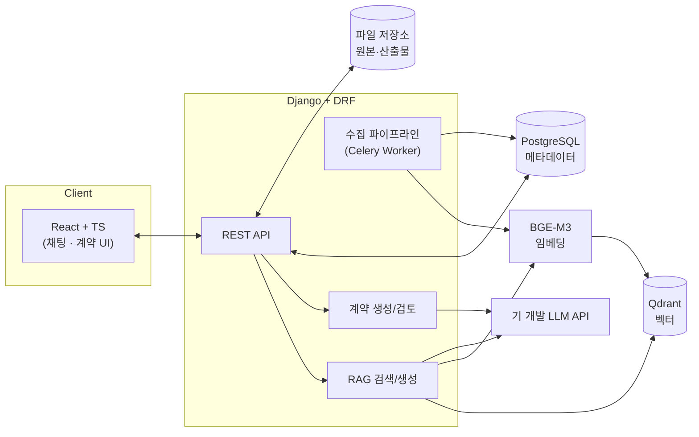
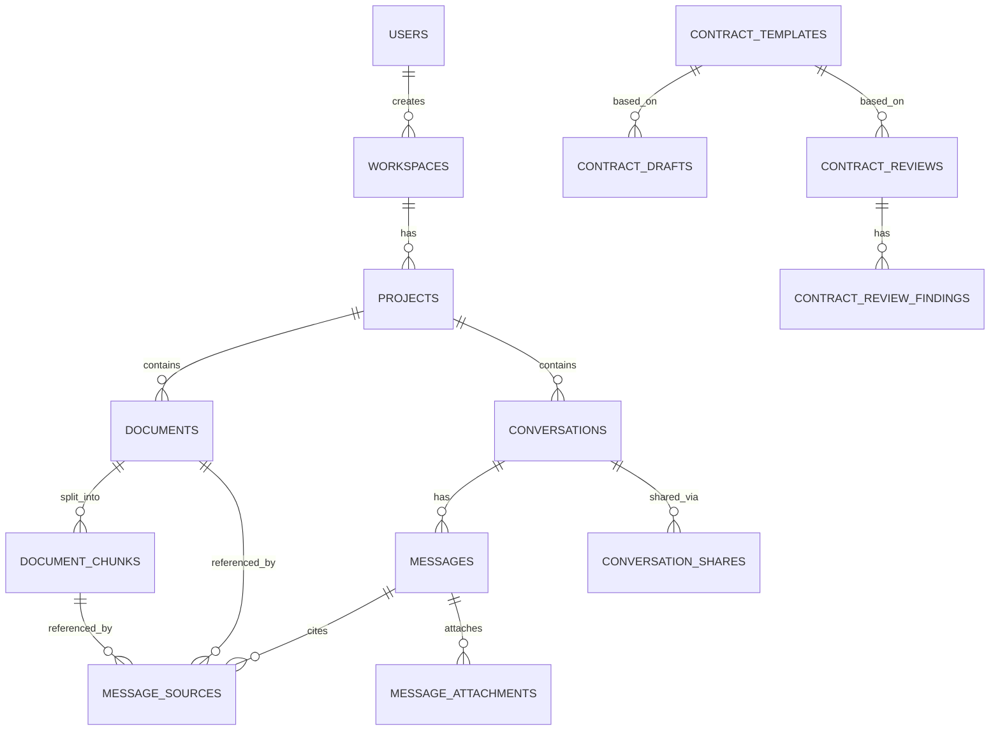

# 재생E AI Agent — 프로젝트 기획서

> 재생에너지(태양광·풍력) 사업개발실의 사내 자료 기반 AI Agent
> RAG 챗봇 + 계약서 기능 우선 개발 (재무모델·대시보드는 항목 정의만, 개발 보류)
> 개발 환경: **Antigravity** · 백엔드 **Django + Qdrant + BGE-M3** · 프론트 **React + TypeScript** · Main DB **PostgreSQL**

---

## 0. 문서 목적과 범위

### 0.1 목적
사업개발실 내 방대한 PJT 자료(약 30TB, OneDrive)에 흩어진 경험·정보를 DB화하여, 질의응답·계약서 작성/검토를 통해 의사결정의 질과 속도를 높이는 AI Agent를 구축한다.

### 0.2 이번 개발 범위 (Scope)

| 구분 | 기능 | 이번 범위 |
|---|---|---|
| ✅ | **RAG 챗봇** (사내 자료 기반 질의응답) | **개발** |
| ✅ | **계약** (표준 계약서 생성 / 검토) | **개발** |
| ⏸ | 재무모델 (생성 / 검토) | 항목 정의만, **개발 보류** |
| ⏸ | 운영관리 Dashboard (종합 / PJT별 상세) | 항목 정의만, **개발 보류** |
| ❌ | Risk Mgmt, 도면 검토/생성, PVsyst | 제외 |

> 재무모델·대시보드는 스키마와 메뉴 자리만 남겨두어, 추후 확장 시 구조 변경 없이 붙일 수 있도록 설계한다.

### 0.3 사용자 / 환경 전제
- 사용자: **AI Agent 관리자 단일 권한** (실무자·파트장·SPC 구분은 추후 반영)
- 플랫폼: **웹 우선**, 추후 모바일 대응 (반응형)
- 보안: 사내망 폐쇄 환경 가정, 외부 보안 제약 최소
- 브랜드 컬러: `#153F35` (Deep Forest Green)

---

## 1. 기능 정의

### 1.1 공통 기반 — 워크스페이스 / 프로젝트
업로드 자료와 대화를 **워크스페이스 → 프로젝트** 단위로 조직한다. (Claude Projects 유사 구조)

- **워크스페이스**: 최상위 컨테이너 (예: 사업개발실)
- **프로젝트**: 개별 PJT 또는 주제 단위 (예: "새만금 태양광", "풍력 PPA")
  - 프로젝트에 사내 문서를 귀속시켜 해당 프로젝트 대화에서 우선 참조
  - `is_shared = true` → **공용 프로젝트(공용 방)**: 대화 공유·반출의 목적지
- **전사 공용 코퍼스**: 특정 프로젝트에 속하지 않는 전사 공통 자료 (`project_id = NULL`)

### 1.2 RAG 챗봇

| # | 기능 | 설명 | 비고 |
|---|---|---|---|
| C-1 | 대화 인터페이스 | 입력창 · 답변 영역 · 대화 히스토리 | HTML 시안 반영 |
| C-2 | 사내 문서 참조 토글 | **대화별**로 사내 자료 참조 여부 선택 (체크) | 기본 ON |
| C-3 | 출처 표기 | 답변 하단 출처 칩: **제목 5자**만 표기, **호버 시 전체 파일명 팝업** | 시안 반영 |
| C-4 | 출처 원문 열람 | 출처 칩 **클릭 시 해당 문서를 실제로 열람** | 신규 |
| C-5 | 출처 내 위치 표기 | 참조한 자료 **내에서의 위치(페이지/조항/시트)** 표기 | 신규 |
| C-6 | 문서 첨부 | 대화 중 PDF·Word·Excel 첨부 후 질의 | 신규 |
| C-7 | 대화 공유·반출 | 대화를 **공용 프로젝트 방으로 전송**(복사/이동) | 신규 |
| C-8 | 워크스페이스·프로젝트 관리 | 프로젝트 단위 대화/문서 묶음 관리 | 신규 |

#### RAG 동작 흐름
1. **수집(Ingest)**: 문서 업로드 → 파싱(PDF/Word/Excel) → 청킹(chunking) → **BGE-M3 임베딩** → **Qdrant 적재** + 청크 메타데이터 PostgreSQL 저장
2. **질의(Query)**: 질문 임베딩 → Qdrant **하이브리드 검색**(dense+sparse) → (선택) 재정렬 → 컨텍스트 구성 → **LLM 답변 생성** → 출처(청크) 매핑
3. **표기**: 답변 + 출처 칩(문서·페이지·조항) → 클릭 시 원문 뷰어에서 해당 위치로 이동

### 1.3 계약

#### 1.3.1 표준 계약서 종류 정의 (마스터 데이터)
계약 기능의 기준이 되는 표준 계약서 유형을 사전 정의한다. 각 유형은 **표준 양식 본문**, **Key-term 입력 스키마**, **검토 체크리스트**를 가진다.

| 코드 | 약어 | 한글명 | 분류 |
|---|---|---|---|
| `JDA` | JDA | 공동개발협약 (Joint Development Agreement) | 개발 |
| `SPA` | SPA | 지분/자산 매매계약 (Sale & Purchase Agreement) | 인수 |
| `SHA` | SHA | 주주간 협약 (Shareholders Agreement) | 지배구조 |
| `EPC` | EPC | 설계·조달·시공 도급계약 | 건설 |
| `OM` | O&M | 운영·유지보수 계약 | 운영 |
| `OE` | 감리/OE | 감리·발주자엔지니어(Owner's Engineer) 계약 | 건설 |
| `FIN` | 금융약정 | 금융약정 (Project Finance) | 금융 |
| `DD` | FDD/TDD/LDD | 실사 자문용역 (재무/기술/법률) | 자문 |
| `DSA_SLA` | DSA/SLA | 직접계약(Direct Agreement)/서비스수준협약 | 금융/운영 |
| `ADMIN` | 사무위탁 | 사무위탁 계약 | 경영관리 |
| `LEASE` | 임대차 | (토지) 임대차 계약 | 개발 |
| `GSVC` | 일반용역 | 일반용역 계약 | 공통 |
| `PSVC` | 인허가용역 | 인허가용역 계약 | 개발 |
| `PPA_REC` | PPA/REC | 전력판매계약/REC 거래계약 | 매출 |
| `NDA` | NDA | 비밀유지계약 | 공통 |
| `MOU` | MOU | 양해각서 | 공통 |

#### 1.3.2 계약 기능

| # | 기능 | 입력 | 처리 | 출력 |
|---|---|---|---|---|
| K-1 | **계약서 신규 생성** | 계약 유형 선택 + **Key-term 입력** | 표준 양식에 Key-term 매핑 → LLM 초안 생성 | 화면 미리보기 + **Word 다운로드** |
| K-2 | **계약서 검토** | 계약서 파일 업로드(또는 Key-term) + **검토 지시** | 표준 양식·체크리스트 대비 검토 | **조항별 결과 표**(위험도/지적/수정방향) + **Word 다운로드** |

> 검토 결과 표 구성: `조항 위치` · `위험도(독소/불리/누락/오류)` · `지적 내용` · `수정 방향`

### 1.4 (보류) 재무모델 — 항목 정의만
- 재무모델 생성: 주요 가정사항 입력 → 모델 자동 생성 → Excel 다운로드
- 재무모델 검토: Excel 업로드 → 수식 오류 검토 → `셀 위치 / 이상 내용 / 수정 방향` 표
- 스키마에 자리만 마련(섹션 4.4 참조), 이번 개발 미진행

### 1.5 (보류) 운영관리 Dashboard — 항목 정의만
- 종합: 총 용량, 발전량, PJT별 주요 Event 요약
- PJT별 상세: 용량, 발전량, CCTV, Database(O&M 보고서·이슈 Report)
- 이번 개발 미진행

---

## 2. 기술 스택

| 레이어 | 기술 | 역할 |
|---|---|---|
| 프론트엔드 | **React 18 + TypeScript**, Vite | SPA UI (시안 기반) |
| | TanStack Query, Zustand | 서버 상태 / 클라이언트 상태 |
| | Tailwind CSS | 스타일 (`#153F35` 토큰) |
| 백엔드 | **Django 5 + Django REST Framework** | API 서버 |
| | Celery + Redis | 비동기 문서 수집/임베딩 작업 (권장) |
| 벡터 검색 | **Qdrant** | 청크 임베딩 저장 / 하이브리드 검색 |
| 임베딩 | **BGE-M3** (FlagEmbedding) | dense(1024) + sparse 다국어 임베딩 |
| Main DB | **PostgreSQL 16** | 메타데이터·대화·계약 등 정형 데이터 |
| 문서 파싱 | PyMuPDF(PDF), python-docx(Word), openpyxl/pandas(Excel) | 텍스트·위치 추출 |
| LLM | 기 개발 LLM API 연동(어댑터 추상화) | 답변/계약 생성 |
| 파일 저장 | 로컬 볼륨 또는 MinIO(S3 호환) | 원본 문서·산출물 |
| 컨테이너 | **Docker Compose** | 통합 실행 환경 |

### 2.1 입력 → 처리 → 출력 (요약)
```
[수집] 문서(PDF/Word/Excel) → 파싱 → 청킹 → BGE-M3 임베딩 → Qdrant + PostgreSQL(메타)
[질의] 질문 → BGE-M3 임베딩 → Qdrant 하이브리드 검색 → 컨텍스트 → LLM → 답변 + 출처
[계약] Key-term/파일 → 표준양식·체크리스트 → LLM → 초안/검토표 → Word 산출
```

---

## 3. 시스템 아키텍처



### 3.1 RAG 검색 상세
- **임베딩**: BGE-M3 → dense 1024차원(Cosine) + sparse(lexical) 동시 산출
- **검색**: Qdrant `query` API로 dense+sparse **하이브리드**(RRF/가중) 검색, `project_id`/`is_global` 필터로 범위 한정
- **컨텍스트**: 상위 K개 청크(기본 6) → 토큰 예산 내 조립, 각 청크의 `page_number`·`section_title` 보존
- **출처 매핑**: LLM 답변에 인용된 청크 → `message_sources`에 기록 → UI 칩/원문 위치 연결

---

## 4. 데이터 모델 (DB 스키마)

### 4.1 ER 개요



### 4.2 공통 / 워크스페이스

**users** — 사용자(현재 관리자 단일, 확장 대비)

| 컬럼 | 타입 | 설명 |
|---|---|---|
| id | UUID PK | |
| email | VARCHAR UNIQUE | |
| name | VARCHAR | |
| department | VARCHAR | 소속 |
| role | VARCHAR | `admin` / `member`(추후) |
| created_at / updated_at / last_login_at | TIMESTAMPTZ | |

**workspaces** — 최상위 컨테이너

| 컬럼 | 타입 | 설명 |
|---|---|---|
| id | UUID PK | |
| name | VARCHAR | |
| slug | VARCHAR UNIQUE | |
| description | TEXT | |
| settings | JSONB | 기본 모델·검색옵션 등 |
| created_by | UUID FK→users | |
| created_at / updated_at | TIMESTAMPTZ | |

**projects** — PJT/주제 단위 (공용 방 포함)

| 컬럼 | 타입 | 설명 |
|---|---|---|
| id | UUID PK | |
| workspace_id | UUID FK→workspaces | |
| name | VARCHAR | |
| description | TEXT | |
| is_shared | BOOLEAN | 공용 프로젝트(반출 목적지) |
| icon / color | VARCHAR | UI |
| created_by | UUID FK→users | |
| created_at / updated_at | TIMESTAMPTZ | |

### 4.3 RAG — 문서 / 대화

**documents** — 사내 자료 원본 메타데이터

| 컬럼 | 타입 | 설명 |
|---|---|---|
| id | UUID PK | |
| project_id | UUID FK→projects NULL | NULL = 전사 공용 코퍼스 |
| title | VARCHAR | 표시 제목(전체 파일명) |
| original_filename | VARCHAR | |
| file_type | VARCHAR | `pdf`/`docx`/`xlsx` |
| storage_uri | VARCHAR | 원본 파일 경로(열람용) |
| file_size | BIGINT | |
| page_count | INT | |
| checksum | VARCHAR | 중복 적재 방지 |
| status | VARCHAR | `uploaded`/`parsing`/`embedding`/`indexed`/`failed` |
| metadata | JSONB | 작성부서·작성일 등 |
| uploaded_by | UUID FK→users | |
| created_at / indexed_at | TIMESTAMPTZ | |

**document_chunks** — 청크 메타(벡터 본체는 Qdrant)

| 컬럼 | 타입 | 설명 |
|---|---|---|
| id | UUID PK | |
| document_id | UUID FK→documents | |
| chunk_index | INT | 문서 내 순서 |
| content | TEXT | 청크 원문(스니펫/재정렬용) |
| page_number | INT | **출처 위치** |
| section_title | VARCHAR | 조항/제목(예: "제3조") |
| char_start / char_end | INT | 문서 내 오프셋 |
| bbox | JSONB | PDF 좌표(뷰어 하이라이트용) |
| sheet_name / cell_range | VARCHAR | Excel 위치 |
| token_count | INT | |
| qdrant_point_id | UUID | Qdrant 포인트 매핑 키 |
| created_at | TIMESTAMPTZ | |

**conversations** — 대화

| 컬럼 | 타입 | 설명 |
|---|---|---|
| id | UUID PK | |
| project_id | UUID FK→projects NULL | |
| title | VARCHAR | 자동 요약 제목 |
| use_internal_docs | BOOLEAN | **사내 문서 참조 토글(대화별)**, 기본 TRUE |
| is_shared | BOOLEAN | 공유됨 여부 |
| created_by | UUID FK→users | |
| last_message_at | TIMESTAMPTZ | 정렬용 |
| created_at / updated_at | TIMESTAMPTZ | |

**messages** — 메시지

| 컬럼 | 타입 | 설명 |
|---|---|---|
| id | UUID PK | |
| conversation_id | UUID FK→conversations | |
| role | VARCHAR | `user`/`assistant`/`system` |
| content | TEXT | |
| used_internal_docs | BOOLEAN | 해당 응답이 사내자료 참조했는지 |
| model | VARCHAR | 사용 LLM |
| token_usage | JSONB | |
| status | VARCHAR | `pending`/`done`/`failed` |
| created_at | TIMESTAMPTZ | |

**message_sources** — 출처(인용) ★ 핵심

| 컬럼 | 타입 | 설명 |
|---|---|---|
| id | UUID PK | |
| message_id | UUID FK→messages | |
| document_id | UUID FK→documents | 원문 열람 대상 |
| document_chunk_id | UUID FK→document_chunks NULL | |
| display_title | VARCHAR | **전체 파일명(호버 팝업용)** |
| short_label | VARCHAR | **표시용 5자(칩)** |
| page_number | INT | **위치 표기/이동** |
| location_label | VARCHAR | 예: "p.12 · 제3조" |
| score | FLOAT | 검색 점수 |
| rank | INT | 표시 순서 |
| snippet | TEXT | 미리보기 |
| created_at | TIMESTAMPTZ | |

**message_attachments** — 대화 첨부파일

| 컬럼 | 타입 | 설명 |
|---|---|---|
| id | UUID PK | |
| conversation_id | UUID FK→conversations | |
| message_id | UUID FK→messages NULL | |
| filename / file_type / storage_uri / file_size | | |
| parsed_text_uri | VARCHAR NULL | 추출 텍스트 |
| created_at | TIMESTAMPTZ | |

**conversation_shares** — 대화 공유/반출

| 컬럼 | 타입 | 설명 |
|---|---|---|
| id | UUID PK | |
| conversation_id | UUID FK→conversations | 원본 대화 |
| shared_to_project_id | UUID FK→projects | **공용 프로젝트 방** |
| share_type | VARCHAR | `copy`/`move`/`link` |
| shared_by | UUID FK→users | |
| created_at | TIMESTAMPTZ | |

### 4.4 계약

**contract_templates** — 표준 계약서 종류(마스터)

| 컬럼 | 타입 | 설명 |
|---|---|---|
| id | UUID PK | |
| code | VARCHAR UNIQUE | `JDA`,`SPA`,... (1.3.1 표) |
| name_ko / name_en | VARCHAR | |
| category | VARCHAR | 개발/인수/건설/운영/금융/자문/공통 등 |
| description | TEXT | |
| template_body | TEXT | 표준 양식(placeholder 포함) |
| key_term_schema | JSONB | 입력 필드 정의(라벨/타입/필수) |
| standard_clauses | JSONB | 표준 조항 목록 |
| review_checklist | JSONB | 검토 기준(독소/누락 체크) |
| version | VARCHAR | |
| is_active | BOOLEAN | |
| created_at / updated_at | TIMESTAMPTZ | |

**contract_drafts** — 계약서 신규 생성(K-1)

| 컬럼 | 타입 | 설명 |
|---|---|---|
| id | UUID PK | |
| project_id | UUID FK→projects NULL | |
| template_id | UUID FK→contract_templates | |
| title | VARCHAR | |
| key_terms | JSONB | 사용자 입력 Key-term |
| generated_content | TEXT | 생성 초안 |
| output_file_uri | VARCHAR | Word 산출물 |
| status | VARCHAR | `draft`/`generating`/`completed`/`failed` |
| created_by | UUID FK→users | |
| created_at / updated_at | TIMESTAMPTZ | |

**contract_reviews** — 계약서 검토(K-2)

| 컬럼 | 타입 | 설명 |
|---|---|---|
| id | UUID PK | |
| project_id | UUID FK→projects NULL | |
| template_id | UUID FK→contract_templates NULL | 추정 유형 |
| title | VARCHAR | |
| source_document_uri | VARCHAR | 업로드한 검토 대상 |
| review_instruction | TEXT | 검토 지시 |
| summary | TEXT | 검토 총평 |
| output_file_uri | VARCHAR | Word 산출물 |
| status | VARCHAR | `pending`/`reviewing`/`completed`/`failed` |
| created_by | UUID FK→users | |
| created_at / updated_at | TIMESTAMPTZ | |

**contract_review_findings** — 검토 결과 항목

| 컬럼 | 타입 | 설명 |
|---|---|---|
| id | UUID PK | |
| review_id | UUID FK→contract_reviews | |
| clause_ref | VARCHAR | 조항 위치(예: "제12조") |
| severity | VARCHAR | `high`/`mid`/`low` (독소/불리/누락·경고) |
| category | VARCHAR | 독소조항/불리조항/누락/오류 |
| finding | TEXT | 지적 내용 |
| suggestion | TEXT | 수정 방향 |
| source_clause_ref | VARCHAR NULL | 표준양식 근거 조항 |
| order_index | INT | |
| created_at | TIMESTAMPTZ | |

### 4.5 (보류) 재무모델·대시보드 자리
이번 미개발. 추후 `financial_models`, `financial_model_findings`, `plants`, `generation_records`, `plant_events`, `plant_documents` 등을 동일 패턴으로 추가. 스키마/메뉴 자리만 유지.

### 4.6 Qdrant 컬렉션 설계

| 항목 | 값 |
|---|---|
| 컬렉션 | `re_documents` |
| dense 벡터 | size **1024**, distance **Cosine** (BGE-M3 dense) |
| sparse 벡터 | `bge_sparse` (BGE-M3 lexical) → 하이브리드 |
| point id | `document_chunks.qdrant_point_id` |
| payload | `chunk_id`, `document_id`, `project_id`, `is_global`, `document_title`, `page_number`, `section_title`, `file_type`, `created_at` |
| payload index | `project_id`, `is_global`, `file_type` (필터 검색용) |

> 검색 시 `project_id == 현재 프로젝트 OR is_global == true` 필터를 적용해 범위를 한정한다.

---

## 5. API 설계 (주요 엔드포인트)

### 5.1 워크스페이스 / 프로젝트
```
GET    /api/workspaces
GET    /api/projects?workspace_id=
POST   /api/projects
```

### 5.2 문서 / 수집
```
POST   /api/documents                 # 업로드(비동기 수집 트리거)
GET    /api/documents?project_id=
GET    /api/documents/{id}            # 메타
GET    /api/documents/{id}/file       # 원문 열람(출처 클릭)  ?page=12 위치 이동
GET    /api/documents/{id}/status     # 수집 진행 상태
```

### 5.3 챗봇
```
POST   /api/conversations
GET    /api/conversations?project_id=
PATCH  /api/conversations/{id}        # title, use_internal_docs 토글
POST   /api/conversations/{id}/messages   # 질의 → 답변(+sources) 반환(SSE 스트리밍)
POST   /api/conversations/{id}/attachments
POST   /api/conversations/{id}/share      # 공용 프로젝트로 반출
```
**메시지 응답 예시**
```json
{
  "message": { "role": "assistant", "content": "..." },
  "sources": [
    {
      "document_id": "…",
      "short_label": "새만금태",
      "display_title": "새만금 태양광 발전사업허가 검토보고서_v3.pdf",
      "page_number": 12,
      "location_label": "p.12 · 제3조",
      "open_url": "/api/documents/…/file?page=12",
      "score": 0.82
    }
  ]
}
```

### 5.4 계약
```
GET    /api/contract-templates                  # 표준 계약서 종류
GET    /api/contract-templates/{code}           # Key-term 스키마 포함
POST   /api/contracts/drafts                     # 신규 생성(K-1)
GET    /api/contracts/drafts/{id}/download       # Word 다운로드
POST   /api/contracts/reviews                    # 검토 실행(K-2, 파일+지시)
GET    /api/contracts/reviews/{id}               # findings 표 포함
GET    /api/contracts/reviews/{id}/download      # Word 다운로드
```

---

## 6. Docker Compose 구성

`docker-compose.yml` 별도 파일 제공. 핵심 서비스:

| 서비스 | 이미지/빌드 | 포트 | 비고 |
|---|---|---|---|
| `postgres` | postgres:16 | 5432 | Main DB |
| `qdrant` | qdrant/qdrant:latest | 6333/6334 | 벡터 |
| `backend` | ./backend (Django) | 8000 | API |
| `frontend` | ./frontend (React) | 5173 | UI |
| `redis` | redis:7 | 6379 | (권장) Celery 브로커 |
| `worker` | ./backend (celery) | — | (권장) 비동기 수집/임베딩 |

> BGE-M3는 backend/worker 컨테이너 내 FlagEmbedding으로 로드. 컴퓨팅 여유가 없으면 별도 `embedding`(FastAPI) 서비스로 분리 가능. 사양 부족 우려가 있으므로 **CPU 모드 + 배치 임베딩**으로 시작하고, 필요 시 GPU 노드로 이전.

---

## 7. 프로젝트 디렉토리 구조 (제안)

```
re-ai-agent/
├─ docker-compose.yml
├─ .env
├─ backend/                  # Django + DRF
│  ├─ config/                # settings, urls, celery
│  ├─ apps/
│  │  ├─ accounts/           # users
│  │  ├─ workspaces/         # workspace, project
│  │  ├─ documents/          # 업로드·파싱·청킹
│  │  ├─ rag/                # 임베딩(BGE-M3)·Qdrant·검색·LLM
│  │  ├─ chat/               # conversation, message, sources, share
│  │  └─ contracts/          # template, draft, review, findings
│  ├─ services/
│  │  ├─ embedding.py        # BGE-M3 래퍼
│  │  ├─ qdrant_client.py    # 컬렉션·하이브리드 검색
│  │  ├─ parser/             # pdf/docx/xlsx 파서(위치 추출)
│  │  ├─ llm.py              # LLM 어댑터(기 개발 LLM 연동)
│  │  └─ docx_export.py      # 계약 Word 산출
│  ├─ requirements.txt
│  └─ Dockerfile
├─ frontend/                 # React + TS (시안 기반)
│  ├─ src/
│  │  ├─ features/chat/      # 채팅·출처 칩·원문 뷰어
│  │  ├─ features/contracts/ # 생성/검토
│  │  ├─ features/projects/  # 워크스페이스/프로젝트
│  │  └─ shared/ui/          # 디자인 토큰(#153F35)
│  ├─ package.json
│  └─ Dockerfile
└─ db/
   └─ schema.sql             # 초기 스키마
```

---

## 8. 개발 로드맵 (Antigravity 작업 단위)

각 단계는 Antigravity 에이전트에 순차 위임 가능한 단위로 구성한다.

| 단계 | 작업 | 산출 |
|---|---|---|
| **0. 환경** | docker-compose 기동, Postgres/Qdrant 연결 확인, schema.sql 적재 | 로컬 구동 |
| **1. 기반** | Django 프로젝트·앱 스캐폴딩, 모델 마이그레이션, users/workspaces/projects CRUD | API 골격 |
| **2. 수집** | 업로드 API + 파서(PDF/Word/Excel, 위치 추출) + 청킹 + BGE-M3 임베딩 + Qdrant 적재 | 문서 인덱싱 |
| **3. RAG 챗봇** | 하이브리드 검색 → LLM 답변 → 출처 매핑(message_sources) + SSE 스트리밍 | C-1~C-5 |
| **4. 챗봇 UI** | React 채팅(시안), 사내참조 토글, 출처 칩(5자/호버), 원문 뷰어, 첨부, 공유/반출 | C-1~C-8 |
| **5. 계약 데이터** | 표준 계약서 16종 시드(template_body·key_term_schema·checklist) | 마스터 |
| **6. 계약 생성** | Key-term → LLM 초안 → Word 다운로드 | K-1 |
| **7. 계약 검토** | 업로드+지시 → 검토 findings 표 → Word 다운로드 | K-2 |
| **8. 정리** | 인증·로깅·오류 처리·메뉴 자리(재무/대시보드 비활성) | PoC 완료 |

### 8.1 성공 기준
- 사내 자료 학습 기반으로 **출처가 명확한** 질의응답 제공(클릭 시 원문·위치 확인)
- 16종 표준 계약서 중 주요 유형에 대해 **초안 생성 / 검토 표 + Word 산출**

---

## 9. 리스크 / 유의사항
- **컴퓨팅 용량**: BGE-M3 임베딩·LLM 추론 부하 → 배치/큐 처리, GPU 확보 검토
- **데이터 정제**: 30TB 자료의 형식 편차(스캔 PDF 등) → OCR 필요분 식별, 단계적 인덱싱
- **출처 위치 정확도**: 파서가 page/조항/셀을 신뢰성 있게 추출해야 C-4·C-5 품질 결정
- **권한 모델**: 현재 단일 관리자 → SPC/본사 구분, 프로젝트 접근권한은 추후 `project_members`로 확장

---

*본 문서는 RAG 챗봇 + 계약 기능 우선 개발을 위한 기준 문서이며, 재무모델·대시보드는 동일 패턴으로 확장한다.*
